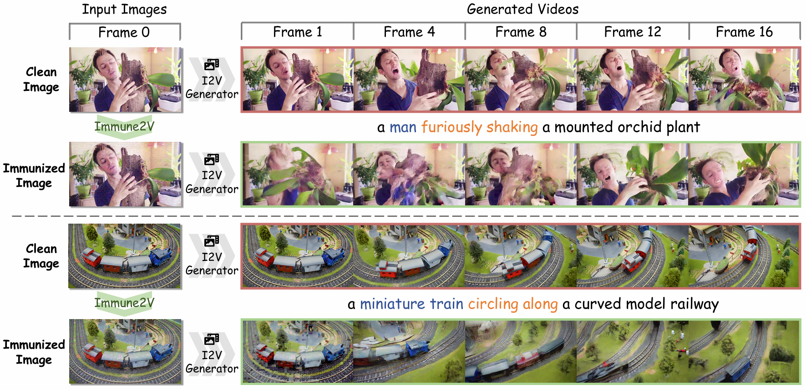

<div align="center">
  
# 💉 Immune2V: Image Immunization Against Dual-Stream Image-to-Video Generation

[Zeqian Long](https://zeqian-long.github.io/)<sup>1*</sup>, [Ozgur Kara](https://karaozgur.com/)<sup>1*</sup>, [Haotian Xue](https://xavihart.github.io/)<sup>2*</sup>, [Yongxin Chen](https://yongxin.ae.gatech.edu/)<sup>2</sup>, [James M. Rehg](https://rehg.org/)<sup>1</sup>

<sup>1</sup> University of Illinois Urbana-Champaign,  <sup>2</sup> Georgia Institute of Technology

</div>


<p>
We propose <b>Immune2V</b>, an image immunization framework designed to prevent the unauthorized animation of protected images by I2V models.
</p>

<p align="center">

</p>


# 🔥 News

- [2026.3.9] Paper will be released soon!


# 🛠️ Code Setup
We adopt our source code from DiffSynth-Studio (Licensed under Apache License 2.0.). You can refer to their [official repo](https://github.com/modelscope/DiffSynth-Studio), or running the following command to construct the environment.
```
pip install -r requirements.txt
```


We recommend running the experiments on a GPU with at least 80GB VRAM (e.g., **A100-80GB**). 
The system should also provide at least **100GB** of available disk space to download and store the model weights.


# 🤗 Model Download
Download models using huggingface-cli:

```
pip install "huggingface_hub[cli]"
huggingface-cli download Wan-AI/Wan2.1-I2V-14B-480P --local-dir ./models/Wan-AI/Wan2.1-I2V-14B-480P 
```
Or modify the local-dir as needed.


# 🪄 Immunize your own image

## Command Line
You can run the following scripts in the terminal to attack your own image. 
```
python -m run_attack.preprocess_data
python -m run_attack.Immune-attack
```

Please modify the hyperparameters in config.yaml accordingly.


Then test using
```
python -m run_attack.Immune-test
```

Some examples shown in the paper are provided in the folder `/attacked`. Due to stochastic sampling and random seed variations, reproduced results may exhibit slight differences.

To run the whole dataset, run
```
chmod +x run_batch_attack.sh
./run_batch_attack.sh
```
